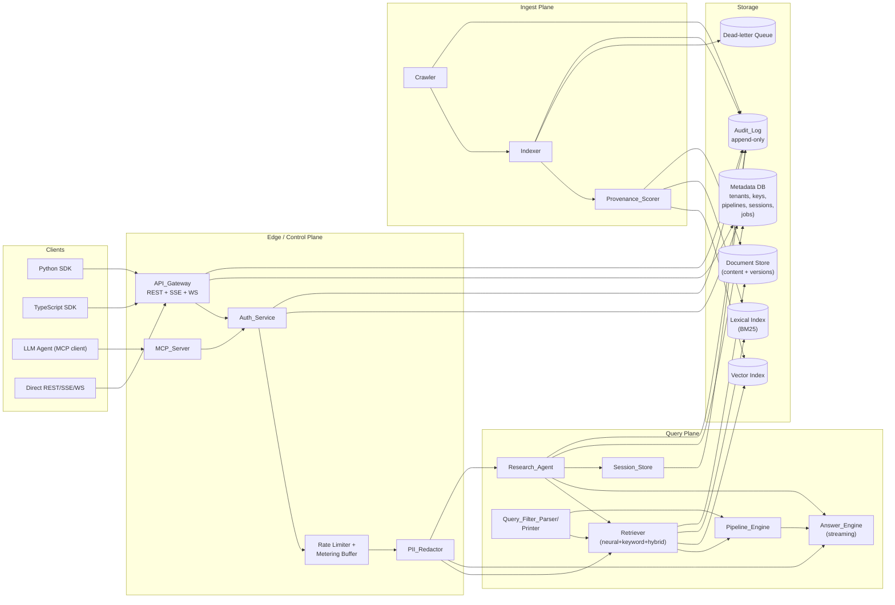
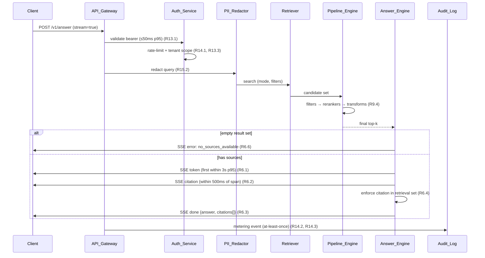
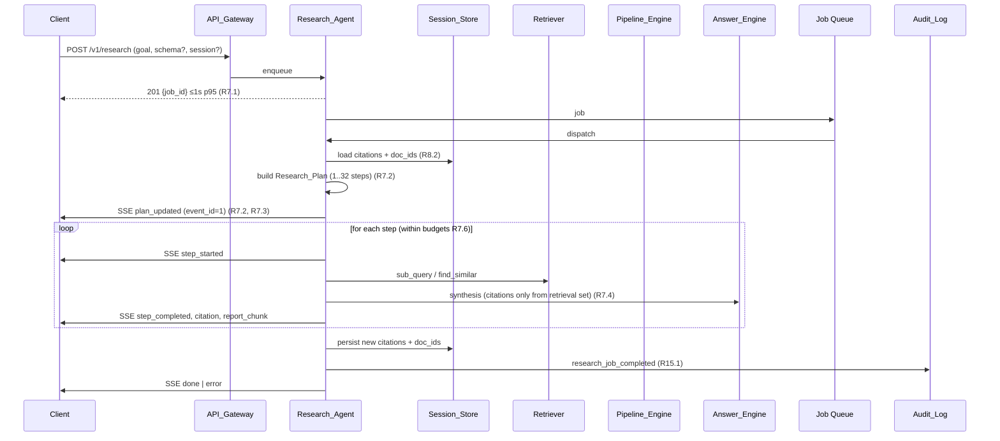
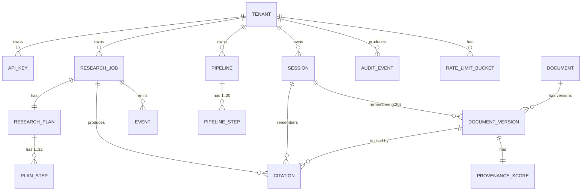
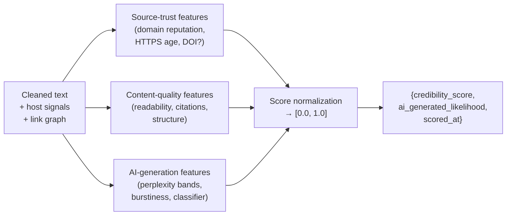

# Design Document

## Overview

The Agentic Research Search Engine (ARSE) is a multi-tenant SaaS that delivers four user-facing capabilities — search, content retrieval, streaming citation-backed answers, and agentic deep research — over REST, SSE, WebSocket, and MCP, plus first-class Python and TypeScript SDKs. The platform is built around six design priorities, each anchored to specific requirement IDs:

1. **Deterministic ranking and pipeline execution** so that identical inputs against an unchanged index version produce identical, byte-stable outputs (R3.4, R4.4, R9.5).
2. **A textual filter DSL with provable parse/print round-trip** to support tooling, version control, and delta UIs over filters (R11.1–R11.8).
3. **Verifiable provenance**: every citation references a concrete `(document_id, version)` that is in the request's retrieval set, and every citation offset range lies within the source document's cleaned text (R6.2, R6.4).
4. **Hard tenant isolation**: every persisted artifact is scoped by `tenant_id`; cross-tenant access yields the same `404` shape as not-found (R8.3, R8.5, R13.3, R7.7, R9.7).
5. **Append-only Audit_Log as a correctness primitive**: privileged actions cannot complete unless the audit append succeeds (R15.1, R15.6).
6. **Streaming with event-id monotonicity and replayability**: SSE consumers can resume after disconnect via `Last-Event-ID` (R7.3, R6.1, R6.5).

The MVP is anchored on five differentiators relative to commodity neural-search products: agentic multi-hop research with inspectable plans, streaming answers with live citations, programmable retrieval pipelines, provenance/credibility scoring, and persistent research sessions with memory.

This document describes the subsystems named in the Glossary, the data model, the API surface shapes, and the cross-cutting strategies (determinism, isolation, streaming, observability) that satisfy the requirements. Implementation details (specific schemas, code) are deferred to the Tasks phase.

## Architecture

### High-level subsystem diagram



### Three principal data flows

**1. Ingest path (R1, R2, R10):** `Crawler → Indexer → Provenance_Scorer → Storage`

```mermaid
sequenceDiagram
    participant C as Crawler
    participant R as robots.txt Cache
    participant OPT as Opt-out Registry
    participant IX as Indexer
    participant DLQ as Dead-letter Queue
    participant PV as Provenance_Scorer
    participant ST as Storage (docs+vec+lex)
    participant AL as Audit_Log

    C->>OPT: domain opted out? (R1.6)
    alt opted out
        C->>AL: domain_opted_out (R1.6)
    else allowed
        C->>R: robots.txt (cache <=24h, 10s timeout) (R1.1)
        alt disallowed / unavailable
            C->>AL: disallowed_by_robots / robots_unavailable (R1.2, R1.3)
        else allowed
            C->>C: enforce per-host concurrency<br/>and Crawl-Delay (R1.4, R1.5)
            C->>IX: raw doc + fetch metadata (R1.7)
            IX->>IX: clean text, hash content
            alt hash matches latest version
                IX->>ST: update last_seen_at only (R2.4)
            else new content
                IX->>PV: score(doc)
                PV-->>IX: credibility, ai_likelihood, scored_at (R10.1)
                IX->>ST: write doc v=existing+1 (R2.3)
            end
            alt index attempt fails 3x
                IX->>DLQ: enqueue (R2.5)
                IX->>AL: index_failure (R2.5)
            end
        end
    end
```

**2. Query path (R3, R9, R10, R13):** `Client → API_Gateway → Auth_Service → PII_Redactor → Retriever → Pipeline_Engine`

**3. Answer path (R6, R8):** `... → Answer_Engine streaming with citations`



**4. Research path (R7, R8):** `Research_Agent + Session_Store`



### Technology choices and rationale

| Concern | Choice | Rationale (req) |
|---|---|---|
| Lexical search | OpenSearch / Elasticsearch (BM25 with custom analyzers) | Mature, supports per-tenant index aliases for isolation (R13.3); deterministic scoring with fixed analysis pipeline (R3.4). |
| Vector search | Vespa or Qdrant with HNSW + on-disk PQ for cost; cosine similarity | Stable, deterministic ANN with seeded graph build; supports payload filtering co-located with vectors (R3.1, R3.4, R10.3, R10.4). |
| Hybrid fusion | Reciprocal-Rank Fusion (RRF) with tenant-tunable k | Deterministic, no learned weights to drift (R3.4). |
| Document & metadata store | PostgreSQL with row-level security; `tenant_id` is part of the primary key on every tenant-scoped table | Strong relational invariants for citations & sessions, easy enforcement of R13.3. |
| Object storage for cleaned text | S3-compatible object store, content-addressed (`tenant_id/doc_id/version`) | Immutable per version, supports R2.3/R2.4 idempotence. |
| Queue / async | Kafka (or Redpanda) for crawl + index + metering streams; Redis Streams for short-lived job dispatch | At-least-once for metering (R14.3); DLQ topic per stage (R2.5). |
| Streaming protocol | SSE primary; WebSocket option for `/v1/answer` for bidirectional cancel | SSE has native `Last-Event-ID` reconnect (R7.3); WS only used where bi-directional control is required. |
| LLM access for Answer_Engine | Provider-abstracted (OpenAI/Anthropic/etc.) behind an internal interface; deterministic mode (`temperature=0`, fixed seed where supported) when `deterministic: true` is requested | Supports R3.4 spirit for answers; falls back to non-deterministic only when explicitly opted into. |
| Tenant DB strategy | **Shared schema, tenant_id-scoped rows + DB row-level security policies + per-tenant index aliases** in OpenSearch/Vespa | Cost-efficient at MVP scale; strong central enforcement of R13.3. Hard isolation tier ("dedicated namespace") is a deferred option. |
| Auth | Tenant-scoped API keys, hashed at rest (Argon2id), prefix-indexed for fast lookup; JWT optional later | Meets R13.1 (50ms p95) via in-memory LRU cache of key hash → tenant. |
| Secrets | KMS-backed envelope encryption for API keys, model provider keys, webhook secrets | Defense in depth; rotation supported via R13.5 grace period. |
| Observability | OpenTelemetry traces + structured JSON logs; Prometheus metrics; per-request `request_id` propagated through every subsystem | Required to compute the many p95 SLOs (R3.2, R6.1, R7.1, R11.1, R13.1, R14). |

## Components and Interfaces

Each subsystem is described as: **Responsibility · Inputs · Outputs · Key interface · Notable invariants**.

### API_Gateway (R3, R4, R5, R6, R7, R8, R9, R13, R14, R15)
- **Responsibility:** Terminate REST + SSE + WS, validate request shape, delegate to Auth_Service, dispatch to query/research/admin handlers, emit metering events, enforce rate limits, enforce uniform `404 not_found` for cross-tenant resource access.
- **Inputs:** HTTP requests with `Authorization: Bearer <api_key>`; SSE/WS upgrades.
- **Outputs:** HTTP responses, SSE/WS event streams, metering events to the metering pipeline.
- **Key interface:** REST endpoints listed in the API contract section.
- **Invariants:** No business handler is invoked before Auth_Service resolves a `tenant_id` (R13.1). Cross-tenant access returns the resource's standard `not_found` code (R7.7, R8.5, R9.7, R13.3).

### Auth_Service (R13, R14)
- **Responsibility:** Authenticate API keys, enforce per-tenant rate limits, gate every persisted-resource read/write by `tenant_id`, emit `auth_failure` audit entries.
- **Inputs:** `Authorization` header, request metadata (`request_id`, source IP, endpoint).
- **Outputs:** Authentication decision, resolved `tenant_id`, rate-limit decision and headers, audit entries.
- **Key interface:** `authenticate(headers) → AuthResult`, `authorize(tenant_id, resource_tenant_id) → bool`, `consume_quota(tenant_id, endpoint) → RateLimitResult`.
- **Invariants:** Bearer token value is never logged (R13.6). Revocation propagates within 60s (R13.4). Both old and new keys are accepted during the rotation grace window in `[1, 86400]` seconds, default 3600 (R13.5).

### PII_Redactor (R15.2)
- **Responsibility:** Redact `email_address`, `phone_number` (E.164), `us_ssn`, `eu_national_id`, `credit_card_number` (Luhn-passing PAN) from any `query` field before any copy lands in Audit_Log or analytics.
- **Inputs:** Raw query string.
- **Outputs:** Redacted string for logging; original retained only in transient request context.
- **Key interface:** `redact(text) → text_with_placeholders`.
- **Invariants:** Redacted form is the only form that crosses the request → audit boundary.

### Crawler (R1)
- **Responsibility:** Fetch public web pages while honoring `robots.txt`, opt-outs, per-host concurrency caps and `Crawl-Delay`.
- **Inputs:** URL frontier (priority sources, discovery queue), opt-out registry, robots cache.
- **Outputs:** Raw documents with `(content, fetch_timestamp_utc, http_status, content_type, canonical_source_url)` (R1.7); audit reasons.
- **Key interface:** `fetch(url) → FetchResult | SkipReason`.
- **Notable invariants:** Per-host in-flight ≤ configured cap in `[1, 8]` (default 2) (R1.4). Sequential requests to the same host are spaced by `max(Crawl-Delay, 1s)` (R1.5). Opt-out applies to all crawls initiated >24h after acceptance (R1.6). robots.txt fetch is bounded by 10s timeout, cached ≤24h (R1.1).

### Indexer (R2, R10)
- **Responsibility:** Convert raw documents into lexical, vector, and metadata index entries; assign and maintain stable `(document_id, version)` identity; trigger Provenance_Scorer; route to DLQ on persistent failure.
- **Inputs:** Raw documents from Crawler.
- **Outputs:** Index writes, `index_failure` audit events on DLQ enqueue.
- **Key interface:** `index(raw_doc) → IndexResult`.
- **Invariants:**
  - Identity: `document_id` is assigned at first ingest and never changes (R2.3).
  - Versioning: re-index with a *different* content hash bumps `version` by exactly 1 (R2.3).
  - Idempotence: re-index with the *same* content hash updates only `last_seen_at` and never mutates `version`, `document_id`, or content (R2.4) — testable as a property.
  - DLQ after 3 attempts spaced ≥60s (R2.5).
  - p95 fetch→searchable in ≤60min, p99 ≤4h (R2.1).
  - "priority sources" re-crawled at least once per rolling 24h (R2.2).

### Retriever (R3, R4, R10)
- **Responsibility:** Execute neural, keyword, or hybrid retrieval over the tenant's view of the index, applying credibility/AI thresholds and filter ASTs; produce a strictly score-ordered ranked list with deterministic tie-breaking.
- **Inputs:** Tenant_id, query, mode, filters (Filter_AST), `num_results`, `min_credibility`, `max_ai_generated_likelihood`, optional pipeline.
- **Outputs:** `RankedResult[]` with `document_id, url, title, score, published_at, provenance{credibility_score, ai_generated_likelihood, scored_at}` (R3.3, R10.2).
- **Key interface:** `retrieve(req: RetrieveRequest) → RankedResult[]`.
- **Invariants:**
  - **Deterministic ranking** for identical `(query, mode, filters, pipeline_id)` against an unchanged index version (R3.4, R4.4) — see "Determinism strategy".
  - Score bounds `[0.0, 1.0]` and non-increasing order (R3.3).
  - `find_similar` excludes every version of the input `document_id` (R4.2).
  - `min_credibility` exclusion is strict-less-than; equality is included (R10.3). `max_ai_generated_likelihood` exclusion is strict-greater-than; equality is included (R10.4) — testable as boundary properties.

### Pipeline_Engine (R9)
- **Responsibility:** Run a tenant-defined ordered pipeline of `filter`, `reranker`, and `transform` steps over Retriever output; enforce step ordering rules; enforce per-step timeouts; surface `step_timeout` warnings.
- **Inputs:** Pipeline definition, Retriever candidates.
- **Outputs:** Final ranked result list with `warnings[]`.
- **Key interface:** `execute(pipeline_id, tenant_id, candidates) → ResultSet`.
- **Invariants:**
  - Step count in `[1, 20]`; every step name resolves to the registry (R9.1, R9.2).
  - Without an explicit cross-type ordering: filters → rerankers → transforms (R9.4).
  - Deterministic outputs across re-runs (R9.5).
  - Per-step timeout in `[100, 30000]` ms, default 2000; on timeout, *skip* the step (pass through its input unchanged), append `step_timeout` warning (R9.6).

### Answer_Engine (R5, R6)
- **Responsibility:** Generate streaming answers over a retrieval result set with inline citations; produce summaries (1–512 tokens) and highlights (≤5 spans) for `/v1/contents`.
- **Inputs:** Retrieval result set, query, optional generation parameters.
- **Outputs:** SSE/WS event stream `{token, citation, done, error}`; `/v1/contents` summaries and highlights.
- **Key interface:** `answer(req) → AsyncIter<Event>`; `summarize(doc, max_tokens) → string`; `highlight(query, doc) → Span[]`.
- **Invariants:**
  - First token within 3s p95 (R6.1); citation within 500ms of span (R6.2).
  - Every emitted citation references a `(document_id, version)` *in the request's retrieval result set* (R6.4) — testable as a referential-integrity property.
  - No-sources case emits exactly one `error: no_sources_available` and closes within 2s (R6.6).
  - Mid-stream model failure or 30s token-silence emits exactly one `error` from a documented enum, then no further `token`/`citation`, then close within 2s (R6.5).
  - On `done`, payload contains the full answer text and the complete set of citations emitted (R6.3) — testable as set-equality.
  - Highlight spans satisfy `0 <= start < end <= len(text)` (R5.2).

### Research_Agent (R7, R8)
- **Responsibility:** Plan and execute multi-hop research jobs as a tool-use loop over Retriever, Pipeline_Engine, and Answer_Engine; persist memory in Session_Store; emit a structured event stream with strictly monotonic `event_id`s; enforce budgets.
- **Inputs:** `research_goal` (1–4096 code points), optional `output_schema`, optional `session_id`, budgets.
- **Outputs:** `job_id`, event stream (`plan_updated`, `step_started`, `step_completed`, `citation`, `report_chunk`, `done`, `error`), final report retrievable via `GET /v1/research/{job_id}`.
- **Key interface:** `start(goal, schema?, session?, budgets) → job_id`; `events(job_id, last_event_id?) → AsyncIter<Event>`; `report(job_id) → Report`.
- **Invariants:**
  - First event is `plan_updated` with 1..32 plan steps before any retrieval (R7.2).
  - Strictly monotonic `event_id` per job; reconnection replays events with `event_id > Last-Event-ID` (R7.3) — testable as monotonicity property.
  - Final report's every factual claim has at least one Citation referencing an indexed document (R7.4) — testable.
  - When `output_schema` is supplied, the structured payload validates against it (R7.5).
  - Budget exceedance terminates with `error: budget_exceeded` and exposes partial report+citations via `GET /v1/research/{job_id}` (R7.6).

### Session_Store (R8, R15)
- **Responsibility:** Store research session memory (citations, retrieved doc_ids), enforce per-tenant access, expire after `retention_days`, emit `session_expired` audit entries.
- **Inputs:** Session create/update/delete operations, retention policy.
- **Outputs:** Session memory subset to feed Research_Agent / Answer_Engine.
- **Key interface:** `create(tenant_id, retention_days) → session_id`; `read_memory(tenant_id, session_id) → {citations[≤50], doc_ids[≤20]}` (R8.2); `expire_pass()` background sweep.
- **Invariants:**
  - `retention_days ∈ [1, 90]`, default 14 (R8.1).
  - Cross-tenant read returns `session_not_found` indistinguishable from no-such-session (R8.5) — testable as tenant-isolation property.
  - On expiry: delete within 24h, stop incorporating memory, emit audit (R8.4).
  - Memory window: ≤50 most recent citations, ≤20 most recent unique doc_ids (R8.2) — testable bounds.

### Provenance_Scorer (R10)
- **Responsibility:** Compute `credibility_score` and `ai_generated_likelihood` for each indexed document; recompute periodically; preserve `document_id` and `version` on recompute.
- **Inputs:** Cleaned document text, host-level signals, link-graph signals, AI-detection signals.
- **Outputs:** `{credibility_score, ai_generated_likelihood, scored_at}` triple.
- **Key interface:** `score(doc) → ProvenanceScore`; `rescore(document_id, version) → ProvenanceScore`.
- **Invariants:**
  - Both scores in `[0.0, 1.0]` (R10.1) — testable as a range property over the generator.
  - Recompute preserves `document_id` and `version`, mutates only `credibility_score`, `ai_generated_likelihood`, `scored_at`, and leaves all other fields untouched (R10.6) — testable as a frame property.
  - Document is not visible to Retriever until scored (R10.1).

### Query_Filter_Parser / Query_Filter_Printer (R11)
- **Responsibility:** Parse Query_Filter_DSL strings to Filter_AST; print Filter_AST back to canonical Query_Filter_DSL; emit precise parse errors with line/column.
- **Inputs:** Source string (1..16384 code points) or Filter_AST.
- **Outputs:** Filter_AST or printed string; or structured ParseError.
- **Key interface:** `parse(s) → Result<Filter_AST, ParseError>`; `print(ast) → string`.
- **Invariants:**
  - Parses within 100ms p95 on a single core (R11.1).
  - Empty / whitespace-only → `empty_input` (R11.2).
  - Invalid input → 1-indexed line + column + 1..256-char description; never returns partial AST (R11.3).
  - Length / nesting / leaf bounds: input ≤16384 code points, ≤32 nesting levels, ≤1024 leaves; otherwise `filter_too_large` (R11.4).
  - **Round-trip:** `parse(print(ast)) ≡ ast` for every Filter_AST (R11.5); `parse(print(parse(s))) ≡ parse(s)` for every parseable s (R11.6) — both tested as properties.
  - Structural equivalence per R11.7 (commutative/non-commutative children, normalized literals).

### MCP_Server (R12)
- **Responsibility:** Expose `search`, `find_similar`, `contents`, `answer`, `research` as MCP tools with JSON Schemas for inputs and outputs; share authentication and rate limits with the REST gateway.
- **Inputs:** MCP tool calls with `Authorization` header.
- **Outputs:** MCP tool responses validated against output schema.
- **Key interface:** Standard MCP `list_tools`, `call_tool`.
- **Invariants:**
  - Validates input arguments against schema before dispatch (R12.3).
  - Dispatches to the same backing subsystems as REST: Retriever for `search`/`find_similar`, Search_Engine for `contents`, Answer_Engine for `answer`, Research_Agent for `research` (R12.2).
  - Same auth + rate limits as REST (R12.4–R12.6).
  - Returns MCP standard tool-execution error if subsystem errors or output fails its schema (R12.7).

### Audit_Log (R1, R2, R8, R13, R15)
- **Responsibility:** Append-only ledger of privileged actions and security-significant events.
- **Key interface:** `append(entry) → ack`; `query(tenant_id, filter) → entries[]` for tenant-visible subset.
- **Invariants:**
  - Entry shape: `actor, action, resource, timestamp(UTC), request_id (16..64 code points)` (R15.1).
  - Append within 5s of action (R15.1).
  - In-place modification rejected; only append (R15.4).
  - Retention `[365, 2555]` days, default 365 (R15.4).
  - Audit append failure blocks the privileged action with `audit_log_unavailable` to caller and is retried (R15.6).

## Data Models

### Entity-relationship overview



### Core types (logical, language-agnostic)

**Tenant**
```
tenant_id        : UUID v4
name             : string
created_at       : ISO8601 UTC
data_retention_days : int [1..2555]
deletion_state   : enum { active, pending_deletion, deleted }
```

**ApiKey** (R13)
```
api_key_id       : UUID
tenant_id        : UUID  (FK)
key_prefix       : string  (indexed; 8–12 chars, displayed in dashboard)
key_hash         : Argon2id hash of full key value
created_at       : ISO8601 UTC
expires_at       : ISO8601 UTC | null
revoked_at       : ISO8601 UTC | null
rotation_grace_seconds : int [1..86400] (default 3600)  // R13.5
```
Invariant: a request authenticates iff exactly one ApiKey row's hash matches AND `revoked_at` is null OR `now < revoked_at + rotation_grace_seconds`.

**Document** and **DocumentVersion** (R2, R10)
```
Document
  document_id    : UUID  (assigned at first ingest, never changes — R2.3)
  tenant_id      : UUID? // null for global crawl-derived docs; tenant-scoped only when user-uploaded
  canonical_url  : string
  first_seen_at  : ISO8601 UTC

DocumentVersion
  document_id    : UUID  (FK)
  version        : int >= 1, monotonic per document_id
  content_hash   : SHA-256 of cleaned text (R2.3, R2.4)
  cleaned_text_uri : string (object store)
  fetch_timestamp_utc : ISO8601
  http_status    : int
  content_type   : string
  source_url     : string
  last_seen_at   : ISO8601 UTC  (mutated by R2.4 idempotent path)
  published_at   : ISO8601 UTC | null
  provenance     : ProvenanceScore
  PRIMARY KEY (document_id, version)
```
Invariant pair (testable):
- If `H(new) == H(latest)`: only `last_seen_at` changes (R2.4).
- If `H(new) != H(latest)`: a new row with `version = latest.version + 1` is inserted; existing rows are unchanged (R2.3).

**ProvenanceScore** (R10)
```
document_id              : UUID
version                  : int
credibility_score        : float [0.0, 1.0]
ai_generated_likelihood  : float [0.0, 1.0]
scored_at                : ISO8601 UTC
```
Invariant: rescoring updates only these three fields; `document_id` and `version` are immutable on rescore (R10.6).

**Citation** (R6, R7)
```
citation_id      : UUID
tenant_id        : UUID
document_id      : UUID
version          : int
answer_start     : int >= 0     // half-open [answer_start, answer_end)
answer_end       : int          // answer_end > answer_start
source_start     : int >= 0     // half-open [source_start, source_end)
source_end       : int          // source_end > source_start
emitted_at       : ISO8601 UTC
job_id           : UUID? // research jobs
session_id       : UUID? // session-bound
FOREIGN KEY (document_id, version) REFERENCES DocumentVersion(document_id, version)
```
Invariants (R6.2, R6.4):
- `answer_start < answer_end ≤ length(answer_text)`.
- `source_start < source_end ≤ length(cleaned_text(document_id, version))`.
- `(document_id, version)` is in the request's retrieval result set.

**Pipeline** and **PipelineStep** (R9)
```
Pipeline
  pipeline_id    : UUID
  tenant_id      : UUID
  name           : string
  created_at     : ISO8601 UTC

PipelineStep
  pipeline_id    : UUID  (FK)
  ordinal        : int >= 0
  type           : enum { filter, reranker, transform }
  registry_name  : string  (must exist in registry — R9.1, R9.2)
  config_json    : object
  timeout_ms     : int [100..30000] (default 2000) — R9.6
  PRIMARY KEY (pipeline_id, ordinal)
```
Invariants: `1 ≤ count(steps) ≤ 20` (R9.1).

**Session** (R8)
```
session_id        : UUID
tenant_id         : UUID
created_at        : ISO8601 UTC
retention_days    : int [1..90] (default 14) — R8.1
expires_at        : ISO8601 UTC = created_at + retention_days
state             : enum { active, expired, deleted }
memory_citations  : ring buffer ≤50 — R8.2
memory_doc_ids    : ring buffer ≤20 distinct — R8.2
```

**ResearchJob** and **ResearchPlan** (R7)
```
ResearchJob
  job_id           : UUID
  tenant_id        : UUID
  session_id       : UUID? // optional
  research_goal    : string (1..4096 code points) — R7.1, R7.8
  output_schema    : object | null  (must validate as JSON Schema — R7.8)
  budgets          : { max_steps, max_duration_ms, max_tool_calls }
  state            : enum { queued, planning, running, succeeded, failed, budget_exceeded }
  created_at       : ISO8601 UTC

ResearchPlan
  job_id           : UUID
  steps            : array of PlanStep, length 1..32 — R7.2
  emitted_at       : ISO8601 UTC

PlanStep
  step_id          : UUID
  type             : enum { sub_query, retrieval, read, synthesis }
  inputs/outputs   : opaque JSON
```

**Event** (research stream; R7.3)
```
event_id         : int64, strictly monotonic per job_id  — R7.3
job_id           : UUID
type             : enum { plan_updated, step_started, step_completed, citation, report_chunk, done, error }
payload          : JSON
emitted_at       : ISO8601 UTC
```
Persisted to a per-job replay buffer to support `Last-Event-ID` resumption (R7.3).

**AuditEvent** (R15)
```
audit_id        : UUID
tenant_id       : UUID | null   // null for unattributable auth_failure (R13.6)
actor           : string
action          : enum { api_key_created, api_key_revoked, pipeline_created, ..., session_expired, deletion_completed, audit_log_unavailable, auth_failure, robots_unavailable, disallowed_by_robots, domain_opted_out, index_failure, metering_delivery_degraded, ... }
resource        : string
timestamp_utc   : ISO8601
request_id      : string [16..64]
detail          : JSON
```

**RateLimitBucket** (R14)
```
tenant_id        : UUID
endpoint         : string
window_start_utc : ISO8601
limit_per_minute : int
remaining        : int
reset_at_utc     : ISO8601
```

**MeteringEvent** (R14)
```
request_id       : string  // dedup key
tenant_id        : UUID
endpoint         : enum { /v1/search, /v1/find_similar, /v1/contents, /v1/answer, /v1/research }
units_consumed   : int >= 0
timestamp_utc    : ISO8601
```

## API Contract Overview

This section is *high-level shapes*; full OpenAPI is generated and published at `/v1/openapi.json` per R16.4.

### REST endpoints

| Method | Path | Purpose | Reqs |
|---|---|---|---|
| `POST` | `/v1/search` | Neural / keyword / hybrid search | R3, R10 |
| `POST` | `/v1/find_similar` | Semantically similar to URL | R4 |
| `POST` | `/v1/contents` | Fetch cleaned text + highlights + summaries | R5 |
| `POST` | `/v1/answer` | Streaming answer with citations (SSE/WS) | R6 |
| `POST` | `/v1/research` | Launch research job | R7 |
| `GET`  | `/v1/research/{job_id}` | Final report (or partial on budget_exceeded) | R7 |
| `GET`  | `/v1/research/{job_id}/events` | SSE event stream with `Last-Event-ID` resume | R7 |
| `POST` | `/v1/sessions` | Create session | R8 |
| `DELETE` | `/v1/sessions/{session_id}` | Delete session | R8, R15 |
| `POST/GET/DELETE` | `/v1/pipelines` (and `/{pipeline_id}`) | Manage pipelines | R9 |
| `POST` | `/v1/admin/api_keys` (and rotate, revoke) | Key management | R13 |
| `POST` | `/v1/data/deletions` | Tenant data deletion request | R15 |
| `GET`  | `/v1/openapi.json` | OpenAPI spec | R16.4 |

All requests require `Authorization: Bearer <api_key>` (R13.1, R16.5). All responses include `X-RateLimit-Limit`, `X-RateLimit-Remaining`, `X-RateLimit-Reset` (R14.4), and `X-Request-Id`.

### Search request shape (R3, R10)
```
POST /v1/search
{
  "query":   string,                      // 1..2048 code points after trim — R3.1, R3.7
  "mode":    "neural" | "keyword" | "hybrid", // R3.6
  "num_results":  int [0..100], default 10,   // R3.5
  "filters":      string,                 // optional Query_Filter_DSL — R11
  "pipeline_id":  uuid,                   // optional — R9.7
  "min_credibility":             float [0.0, 1.0], // R10.3, R10.5
  "max_ai_generated_likelihood": float [0.0, 1.0]  // R10.4, R10.5
}
→ {
  "results": [ { "document_id","url","title","score","published_at",
                 "provenance":{"credibility_score","ai_generated_likelihood","scored_at"} } ],
  "warnings": [ { "code","step" } ]      // e.g. step_timeout — R9.6
}
```

### SSE / WebSocket event shapes

Common SSE framing (text/event-stream):
```
id: <event_id>          // monotonic per stream — R7.3
event: <event_type>
data: <json payload>
\n\n
```

`/v1/answer` (SSE or WS) event types (R6):
- `event: token` — `{"text": string, "index": int}`
- `event: citation` — `{"document_id","version","answer_start","answer_end","source_start","source_end"}`
- `event: done` — `{"answer": string, "citations": Citation[]}`
- `event: error` — `{"code": "no_sources_available" | "model_error" | "stream_timeout" | "internal_error", "message": string}`

`/v1/research/{job_id}/events` event types (R7):
- `plan_updated` — `{"plan": [PlanStep]}`
- `step_started` — `{"step_id","type"}`
- `step_completed` — `{"step_id","summary"}`
- `citation` — `{Citation}`
- `report_chunk` — `{"text","ordinal"}`
- `done` — `{"report_uri"}`
- `error` — `{"code":"budget_exceeded" | "internal_error" | ..., "message"}`

Reconnect rules (R7.3):
- Server reads `Last-Event-ID` header on reconnect.
- Server replays events with `event_id > Last-Event-ID` from the per-job replay buffer (configurable retention; minimum 24h after job termination).
- `event_id` is a per-job monotonically increasing int64.

### MCP tool schemas (R12)

Each REST endpoint has a corresponding MCP tool with the same input/output JSON Schema, generated from the same OpenAPI source-of-truth used by the SDKs (R12.1, R16.4).

| MCP tool | Backing subsystem |
|---|---|
| `search` | Retriever |
| `find_similar` | Retriever |
| `contents` | Search_Engine (Indexer + Answer_Engine) |
| `answer` | Answer_Engine |
| `research` | Research_Agent |

Auth and rate-limit failures map to MCP-standard `authentication_error` and `rate_limit_error` (R12.5, R12.6); subsystem failures map to MCP-standard `tool_execution_error` (R12.7).

## Query_Filter_DSL Grammar (R11)

### EBNF

```ebnf
filter            = or_expr ;
or_expr           = and_expr , { "or"  , and_expr } ;
and_expr          = not_expr , { "and" , not_expr } ;
not_expr          = [ "not" ] , primary ;
primary           = "(" , filter , ")"
                  | comparison ;

comparison        = field , op , literal_or_set
                  | field , "in"  , set_literal
                  | field , range_op , literal ;

field             = ident , { "." , ident } ;        (* e.g. metadata.author *)
ident             = letter , { letter | digit | "_" } ;

op                = "=" | "!=" ;
range_op          = "lt" | "le" | "gt" | "ge" ;

literal           = string_literal | number_literal | timestamp_literal | bool_literal | null_literal ;
literal_or_set    = literal | set_literal ;
set_literal       = "[" , literal , { "," , literal } , "]" ;   (* cardinality 1..256 — R11.8 *)

string_literal    = '"' , { character } , '"' ;                  (* 0..1024 code points — R11.8 *)
number_literal    = [ "-" ] , digit , { digit } , [ "." , { digit } ] ;
timestamp_literal = '@' , iso8601_string ;                        (* normalized to UTC — R11.7 *)
bool_literal      = "true" | "false" ;
null_literal      = "null" ;
```

Supported fields per R11.8: `domain`, `url`, `published_at`, `language`, `category`, `metadata.<segment>` where each segment is `[1..128]` code points and a string literal value is `[0..1024]` code points.

### Filter_AST shape (logical types)

```
FilterAst :=
  | And(children: FilterAst[])      // commutative
  | Or(children: FilterAst[])       // commutative
  | Not(child: FilterAst)           // non-commutative
  | Eq(field, literal)
  | Ne(field, literal)
  | In(field, literals: literal[1..256])  // commutative over the set
  | Range(field, op: lt|le|gt|ge, literal) // non-commutative

literal :=
  | Str(string)      // ≤1024 code points
  | Num(decimal)     // normalized: trim trailing zeros, canonical sign
  | Ts(instant_utc)  // ISO 8601 normalized to UTC, second precision unless explicit fraction
  | Bool(bool)
  | Null
```

### Structural-equivalence rules (R11.7)

Two ASTs `a ≡ b` iff:
1. They share the same operator type.
2. Field references are byte-identical (case-sensitive).
3. Literal values are equal *after normalization*:
   - numeric: equality on canonical decimal (no leading/trailing zeros except a single `0` integer part);
   - timestamp: equality after normalizing to UTC and dropping irrelevant fractional zeros;
   - string/bool/null: byte-equality.
4. For commutative operators (`And`, `Or`, `In`): equality on the *multiset* (or set, for `In`) of children.
5. For non-commutative operators (`Range`, `Not`): equality on the ordered child(ren).

The Printer emits a *canonical form*: child lists for commutative operators are sorted by `(operator_kind, field, literal_canonical)`; literals are emitted in their normalized form; whitespace and parentheses follow the canonical pretty-printer rules. This canonical form is what enables `parse(print(parse(s))) ≡ parse(s)` (R11.6) — testable via the round-trip property.

## Determinism Strategy

Determinism is required by R3.4 (search), R4.4 (find_similar), and R9.5 (pipelines). We achieve it by composing five guarantees:

1. **Stable input normalization.** The query string, filters, mode, `num_results`, and `pipeline_id` are normalized to a canonical form (NFC unicode for query, canonical Filter_AST printing, fixed pipeline serialization) and hashed into a `query_signature`. The cache key, the audit `request_id`, and trace IDs all derive from this signature.
2. **Deterministic candidate generation.**
   - BM25: fixed analyzer, fixed tie-breaker on `(score DESC, document_id ASC, version ASC)`.
   - Vector ANN: HNSW indexes are built with a fixed seed; ANN traversal uses fixed `efSearch`. Where an ANN library exposes nondeterminism, we enable its deterministic mode or fall back to exact search at small `k`.
   - Hybrid: deterministic Reciprocal-Rank Fusion (`rrf_score = Σ 1/(k + rank_i)`) with fixed `k`.
3. **Strict total ordering.** Final ordering is `score DESC, document_id ASC, version ASC` so that ties are broken without reference to memory addresses or wallclock.
4. **Pipeline determinism.** Every pipeline step is required to be a pure function of its declared inputs and config. The registry rejects steps that read mutable global state. Reranker scores follow the same total-order tiebreaker.
5. **Index-version pinning.** "Unchanged index version" is operationally defined as a monotonically increasing integer that increments on any write to a tenant's view. Search responses include `X-Index-Version`; replays against the same `X-Index-Version` are property-tested to be byte-identical.

This satisfies the property test "for any (query, mode, filters, pipeline_id) and any unchanged index version, two retrievals yield identical ordered results" (R3.4, R4.4, R9.5).

## Multi-tenant Isolation Strategy

| Concern | Mechanism | Req |
|---|---|---|
| Auth | API key in `Authorization: Bearer`, hash lookup ≤50ms p95, resolves `tenant_id` before any handler runs | R13.1 |
| Row scoping | Every tenant-scoped table includes `tenant_id` as part of the primary key; PostgreSQL row-level security policies bind `tenant_id` to the connection's `app.tenant_id` GUC | R13.3 |
| Search-engine scoping | Per-tenant index aliases in OpenSearch/Vespa; queries always include a `tenant_id` filter applied at the alias level so that a query without the filter cannot match cross-tenant docs | R13.3, R8.3 |
| Cross-tenant access | Returns the resource's standard `not_found` (HTTP 404 + `<resource>_not_found` code) — uniform shape, no presence disclosure | R7.7, R8.5, R9.7, R13.3, R15.7 |
| Key revocation | Cached key→tenant entries carry a TTL ≤60s; revocation invalidates the cache so subsequent requests fail within 60s | R13.4 |
| Key rotation | New key registered alongside old; both authenticate during `rotation_grace_seconds ∈ [1, 86400]`, default 3600. After grace, old key is denied | R13.5 |
| Audit isolation | Audit entries include `tenant_id`; tenant queries are filtered by `tenant_id`; `auth_failure` entries with unknown keys carry `tenant_id = null` (R13.6) | R13.6, R15 |
| Session isolation | `Session_Store.read_memory` requires `tenant_id` match; non-match returns the same `session_not_found` shape as missing-and-expired | R8.3, R8.5 |

## Streaming Protocol

### SSE event format

```
id: <int64 monotonic per stream>
event: <event_type>
data: <single-line JSON, no embedded newlines (CR/LF escaped)>
retry: <ms>
\n\n
```

- `event_id` is **strictly monotonic** per stream within a job/session lifetime (R7.3). Property-tested.
- A per-job *replay buffer* (durable, retained for at least 24h after terminal event) backs `Last-Event-ID` resumption (R7.3).
- On reconnect with header `Last-Event-ID: N`, server replays all events with `event_id > N` in original order, then continues live.
- Heartbeats: server emits a `:keepalive` comment line every 15s to keep proxies open; heartbeats do not consume `event_id`.

### WebSocket framing for `/v1/answer`

- Each frame is a single JSON object `{ "id": int64, "event": string, "data": object }`.
- Same event-id monotonicity invariants as SSE.
- Client may send `{"op": "cancel"}` to terminate generation early; server emits a final `error: client_cancelled` then closes.

### Error event semantics (R6.5, R6.6)

Documented enum for `/v1/answer` errors:
- `no_sources_available` — empty retrieval set (R6.6).
- `stream_timeout` — 30s of token silence (R6.5).
- `model_error` — upstream model failure (R6.5).
- `internal_error` — unspecified server error.
- `client_cancelled` — WebSocket cancellation.

Documented enum for `/v1/research` errors:
- `budget_exceeded` (R7.6), `internal_error`, `client_cancelled`, `subsystem_error`.

Invariant: at most one `error` event per stream; no `token`/`citation` events follow it; stream closes within 2 seconds of the `error` event (R6.5, R6.6) — testable.

## Crawler Ethics Implementation

| Concern | Implementation | Req |
|---|---|---|
| robots.txt fetch | HTTP GET with 10s timeout, status- and error-aware caching | R1.1 |
| robots.txt cache | Per-host LRU cache with TTL ≤24h; on TTL expiry the next fetch is re-attempted | R1.1 |
| robots.txt failure | Network error / timeout / 5xx → mark unavailable, skip, audit `robots_unavailable` | R1.3 |
| Disallowed URL | Skip and audit `disallowed_by_robots` with URL + matched directive | R1.2 |
| Per-host concurrency | Per-host semaphore sized in `[1, 8]`, default 2; configurable | R1.4 |
| Crawl-Delay | Per-host scheduler enforcing `max(host_crawl_delay, 1s)` between consecutive requests | R1.5 |
| Opt-out registry | Append-only registry keyed by registrable domain with `accepted_at` UTC; new opt-outs are honored on any crawl initiated >24h after acceptance; audit `domain_opted_out` per skipped URL | R1.6 |
| Stored metadata | Each fetched doc stores `fetch_timestamp_utc`, `http_status`, `content_type`, `canonical_source_url` | R1.7 |

## Provenance Scoring Pipeline



- All component features are clipped to `[0, 1]` before combination; final scores are linear or logistic blends bounded by construction. The output is property-tested to lie in `[0.0, 1.0]` (R10.1).
- Recompute path takes `(document_id, version)` and writes only the three fields above; all other fields are passed through unchanged. Property-tested as a frame-property (R10.6).

## Failure Handling

| Failure | Response | Req |
|---|---|---|
| Index attempt fails after 3 retries (≥60s spacing) | Document moved to DLQ; `index_failure` audit; no auto-retry until manual reprocessing | R2.5 |
| robots.txt unavailable | Skip URL; audit `robots_unavailable`; no content fetch | R1.3 |
| Domain opted out | Skip URL; audit `domain_opted_out` | R1.6 |
| Pipeline step timeout | Skip step (pass input through); append `step_timeout` warning to response | R9.6 |
| Stream timeout (≥30s no token) | Emit single `error: stream_timeout`, close ≤2s | R6.5 |
| Empty retrieval set on `/v1/answer` | Emit single `error: no_sources_available`, close ≤2s | R6.6 |
| Research budget exceeded | Terminate with `error: budget_exceeded`; partial report retrievable via `GET /v1/research/{job_id}` | R7.6 |
| Cross-tenant resource access | Uniform `404 <resource>_not_found`; never disclose presence | R7.7, R8.5, R9.7, R13.3, R15.7 |
| Audit_Log append failure (privileged action) | Block action completion; surface `audit_log_unavailable` to caller; retry append until success | R15.6 |
| Metering pipeline unreachable | Persist event to durable local buffer; bounded backoff retries; *never* block API response; audit `metering_delivery_degraded` at 80% buffer fill | R14.5 |
| Auth failure (any) | 401 `unauthenticated`; audit `auth_failure` (no token, no tenant correlation if key unknown) | R13.2, R13.6 |
| Rate-limit exceeded | 429 `rate_limited` with `Retry-After`, `X-RateLimit-*` headers | R14.1 |

### Stream error event enums

The error-code enums for `/v1/answer` and `/v1/research` are enumerated above (Streaming Protocol). Both are part of the published OpenAPI/MCP schemas (R12.1, R16.4) so SDKs can type them as discriminated unions.


## Correctness Properties

*A property is a characteristic or behavior that should hold true across all valid executions of a system — essentially, a formal statement about what the system should do. Properties serve as the bridge between human-readable specifications and machine-verifiable correctness guarantees.*

The properties below are derived from the prework analysis. They are written for property-based testing: each begins with an explicit "for all" / "for any" quantifier and references the requirement(s) it validates. Properties were de-duplicated in the prework reflection step (e.g., the three determinism criteria are unified, and the five cross-tenant-404 criteria are unified).

### Property 1: Re-indexing identical content is idempotent

*For any* existing `DocumentVersion` `v` whose `content_hash` is `h`, re-indexing a document whose cleaned-text `content_hash` equals `h` yields a state in which `document_id`, `version`, `content_hash`, stored cleaned text, and provenance fields are unchanged; only `last_seen_at` may differ.

**Validates: Requirements 2.4**

### Property 2: Re-indexing changed content increments version by exactly one

*For any* existing `DocumentVersion` `v_n` of `document_id D` and any new content whose `content_hash ≠ v_n.content_hash`, indexing produces a new `DocumentVersion` with the same `document_id D` and `version = v_n.version + 1`; existing rows for `D` are unchanged.

**Validates: Requirements 2.3**

### Property 3: Crawler honors robots.txt and per-host throttling

*For any* set of URLs targeting a single host with concurrency cap `C ∈ [1, 8]` and host `Crawl-Delay D ≥ 0`, simulated execution of the Crawler yields (a) at most `C` concurrent in-flight fetches at any timepoint, (b) consecutive request gaps to the same host of at least `max(D, 1s)`, and (c) skip+audit decisions for disallowed URLs that match a reference robots matcher.

**Validates: Requirements 1.2, 1.4, 1.5**

### Property 4: Opt-out registry retroactively excludes a domain

*For any* opt-out record with `accepted_at = T` and any crawl initiated at `T_init > T + 24h`, every URL whose registrable domain matches the opted-out domain is skipped and produces a `domain_opted_out` audit entry.

**Validates: Requirements 1.6**

### Property 5: Search response shape and ordering invariants

*For any* successful response from `/v1/search` or `/v1/find_similar`, every result entry contains the documented fields (`document_id`, `url`, `title`, `score`, `published_at`, `provenance.{credibility_score, ai_generated_likelihood, scored_at}`); every `score` lies in `[0.0, 1.0]`; every `credibility_score` and `ai_generated_likelihood` lies in `[0.0, 1.0]`; and the `score` sequence is non-increasing across the result list.

**Validates: Requirements 3.3, 4.1, 10.1, 10.2**

### Property 6: Deterministic ranking against an unchanged index version

*For any* request `r` to `/v1/search`, `/v1/find_similar`, or `/v1/search` with a `pipeline_id`, two consecutive executions of `r` against the same index version produce byte-identical ordered result lists (same documents, same scores, same order).

**Validates: Requirements 3.4, 4.4, 9.5**

### Property 7: `find_similar` excludes every version of the input document

*For any* indexed document with `document_id D` (regardless of how many versions of `D` exist in the index), no result returned by `/v1/find_similar` for an input URL canonicalizing to `D` has `document_id == D`.

**Validates: Requirements 4.2**

### Property 8: Bounds-violation requests are rejected with a stable error code and never invoke downstream

*For any* request to a `/v1/*` endpoint whose parameter falls outside its documented range — `num_results ∉ [0, 100]`, `mode ∉ {neural, keyword, hybrid}`, `query` length ∉ [1, 2048] code points after trim, URL invalid or > 2048 code points, `document_id` count ∉ [1, 100], `min_credibility` or `max_ai_generated_likelihood` ∉ [0.0, 1.0], `research_goal` length ∉ [1, 4096] code points, or `output_schema` not a syntactically valid JSON Schema — the API_Gateway rejects with HTTP 400 and the documented error code (`invalid_num_results`, `invalid_mode`, `invalid_query`, `invalid_url`, `invalid_document_id_count`, `invalid_threshold`, `invalid_research_request`), and the relevant downstream subsystem is *not* invoked.

**Validates: Requirements 3.5, 3.6, 3.7, 4.5, 4.6, 5.5, 7.8, 10.5**

### Property 9: `/v1/contents` preserves request order and reports per-id errors locally

*For any* request listing 1..100 `document_id` values (any mix of present and absent), the response contains exactly one entry per requested id in the same order; each entry is either a successful payload or an `error` object with code `document_not_found`; the presence of one or more absent ids does not prevent successful entries for the remaining ids.

**Validates: Requirements 5.1, 5.7**

### Property 10: Highlight spans are valid half-open ranges within bounds

*For any* `/v1/contents` response with `highlights: true` and a valid `query`, every highlight span satisfies `0 ≤ start < end ≤ length(cleaned_text)` and the per-document highlight count is in `[0, 5]`.

**Validates: Requirements 5.2**

### Property 11: Summaries are within token bounds

*For any* `/v1/contents` response with `summary: true`, the per-document summary length is in `[1, 512]` model tokens.

**Validates: Requirements 5.3**

### Property 12: `/v1/answer` `done` event reflects the full stream

*For any* successful streaming `/v1/answer` execution, the final `done` event's `answer` field equals the concatenation of all `token` events in emission order, and its `citations` field as a set equals the set of `citation` events emitted during the stream.

**Validates: Requirements 6.3**

### Property 13: Citations on `/v1/answer` reference the request's retrieval result set

*For any* streaming `/v1/answer` execution with retrieval result set `R`, every emitted `citation` event's `(document_id, version)` pair is in `R`; and every emitted citation has `0 ≤ answer_start < answer_end ≤ length(answer_text_so_far)` and `0 ≤ source_start < source_end ≤ length(cleaned_text(document_id, version))`.

**Validates: Requirements 6.2, 6.4**

### Property 14: `/v1/answer` failure modes emit exactly one terminal error

*For any* streaming `/v1/answer` execution that experiences (a) an empty retrieval set, (b) an upstream model failure, or (c) 30 consecutive seconds of token silence, the engine emits exactly one `error` event with a code drawn from the documented enum (`no_sources_available`, `model_error`, `stream_timeout`, `internal_error`), emits no further `token` or `citation` events after the `error`, and closes the stream within 2 seconds of the `error`.

**Validates: Requirements 6.5, 6.6**

### Property 15: Research-job event stream is strictly monotonic and replayable

*For any* research job's event stream, `event_id` values are strictly monotonically increasing; for any reconnection with header `Last-Event-ID = N`, the server replays exactly those events with `event_id > N` in their original ordering before continuing the live stream; the first event of any job is `plan_updated` with a `Research_Plan` of 1..32 steps and no retrieval has occurred prior to that event.

**Validates: Requirements 7.2, 7.3**

### Property 16: Research report citations exist in the index and cover every factual claim

*For any* successfully completed research job, the final report's every factual-claim entry has at least one `Citation`, and every such citation references an indexed `(document_id, version)` pair.

**Validates: Requirements 7.4**

### Property 17: Output schema validation when supplied

*For any* research job request whose `output_schema` is a valid JSON Schema, the final report's structured payload validates against `output_schema`.

**Validates: Requirements 7.5**

### Property 18: Budget exceedance terminates with a partial report

*For any* research job whose execution exceeds its `max_steps`, `max_duration_ms`, or `max_tool_calls` budget, the job's terminal event is an `error` with code `budget_exceeded`, and `GET /v1/research/{job_id}` returns the partial report and citations gathered prior to termination.

**Validates: Requirements 7.6**

### Property 19: Tenant isolation is uniform across resource types

*For any* tenant pair `(A, B)` with `A ≠ B` and any tenant-scoped resource `r` of type `T ∈ {research_job, session, pipeline, audit_entry, deletion_target, metering_record, api_key}` owned by `A`, a request from `B` to read, modify, delete, or stream `r` returns HTTP 404 with the resource type's standard `*_not_found` error code, and the response body is byte-indistinguishable from the response when `r` does not exist in any tenant. Conversely, `A`'s request to `r` succeeds with the standard 2xx response.

**Validates: Requirements 7.7, 8.3, 8.5, 9.7, 13.3, 15.7**

### Property 20: Provenance scoring obeys range and frame invariants

*For any* indexed document, both `credibility_score` and `ai_generated_likelihood` lie in `[0.0, 1.0]` and `scored_at` is set before the document is visible to the Retriever; for any `Provenance_Scorer.rescore(document_id, version)` call, the post-state differs from the pre-state only in `credibility_score`, `ai_generated_likelihood`, and `scored_at` (i.e., `document_id`, `version`, content, and all other fields are unchanged).

**Validates: Requirements 10.1, 10.6**

### Property 21: Provenance threshold filtering uses correct boundary inclusion

*For any* search request specifying `min_credibility = T_c` and/or `max_ai_generated_likelihood = T_a`, every returned result satisfies `result.credibility_score ≥ T_c` (i.e., strict-less-than is excluded; equality is included) and `result.ai_generated_likelihood ≤ T_a` (i.e., strict-greater-than is excluded; equality is included).

**Validates: Requirements 10.3, 10.4**

### Property 22: Query_Filter_DSL printer round-trip on ASTs

*For any* well-formed `Filter_AST` value `ast`, `parse(print(ast))` succeeds and yields a `Filter_AST` structurally equivalent to `ast` under the rules of R11.7 (commutative children compared as multisets / sets; non-commutative children compared as ordered tuples; literals normalized).

**Validates: Requirements 11.5, 11.7, 11.8**

### Property 23: Query_Filter_DSL parser round-trip on strings

*For any* input string `s` of length 1..16,384 code points such that `parse(s)` succeeds, `parse(print(parse(s)))` succeeds and yields a `Filter_AST` structurally equivalent to `parse(s)` under the rules of R11.7.

**Validates: Requirements 11.6, 11.7, 11.8**

### Property 24: Query_Filter_DSL parser rejects oversized / over-nested / over-leaf inputs

*For any* input string longer than 16,384 code points, or whose parse would produce an AST exceeding 32 levels of nesting or 1,024 leaf comparisons, `parse` returns an error with code `filter_too_large` and produces no `Filter_AST`.

**Validates: Requirements 11.4**

### Property 25: Query_Filter_DSL parser produces structured errors on invalid input without partial ASTs

*For any* input string that is not syntactically valid Query_Filter_DSL, `parse` returns an error whose payload includes a 1-indexed line number, a 1-indexed column number pointing to the first offending character, and a 1..256-code-point human-readable description; `parse` does not return a partial `Filter_AST`.

**Validates: Requirements 11.2, 11.3**

### Property 26: Pipeline composition is order-preserving and respects type precedence

*For any* tenant-scoped pipeline definition with steps `s_1..s_n` and any candidate set `C`, executing the pipeline produces the same observed input/output chain as the sequential composition `s_n ∘ … ∘ s_1` applied to `C`, and when no explicit cross-type ordering is given, all `filter` steps execute before all `reranker` steps, which execute before all `transform` steps.

**Validates: Requirements 9.3, 9.4**

### Property 27: Pipeline step timeout falls back to pass-through with a warning

*For any* pipeline step whose execution exceeds its configured `timeout_ms ∈ [100, 30000]`, the step's effective output equals its input (pass-through), and the response's `warnings` array contains a `step_timeout` entry naming the step.

**Validates: Requirements 9.6**

### Property 28: Pipeline persistence rejects unknown step names atomically

*For any* `POST /v1/pipelines` request containing one or more step names not present in the registry, the response is HTTP 400 with code `unknown_pipeline_step` and a list of every offending name; no pipeline is persisted; for any request whose every step name resolves and step count is in `[1, 20]`, the response is 201 with a generated `pipeline_id`.

**Validates: Requirements 9.1, 9.2**

### Property 29: Session memory bounds and recency

*For any* session with prior history of `N` citations and `M` distinct retrieved `document_id` values, the memory subset incorporated into a research/answer request contains the most recent `min(N, 50)` citations and the most recent `min(M, 20)` distinct `document_id` values.

**Validates: Requirements 8.1, 8.2**

### Property 30: Session expiry deletes memory and stops incorporation

*For any* session whose `created_at + retention_days` is in the past, within 24 simulated hours of the expiry time the session's memory is unreachable, no subsequent request incorporates its memory, and the Audit_Log contains a `session_expired` entry capturing `session_id`, `tenant_id`, and the deletion timestamp.

**Validates: Requirements 8.4**

### Property 31: Authentication shape on failure

*For any* request whose bearer token is missing, malformed, unknown, expired, or revoked, the API_Gateway returns HTTP 401 with code `unauthenticated`; no downstream subsystem is invoked; the response body contains no tenant-scoped data; and the corresponding MCP surface returns the MCP-standard authentication error with the same backing decision.

**Validates: Requirements 12.5, 13.2**

### Property 32: API key revocation propagates within 60 seconds

*For any* API key revocation accepted at virtual time `T`, every request presenting that key at virtual time `T' ≥ T + 60s` fails with HTTP 401 `unauthenticated`.

**Validates: Requirements 13.4**

### Property 33: API key rotation grace window

*For any* configured grace `G ∈ [1, 86400]` seconds (default 3,600) and any rotation event accepted at virtual time `T`, both the old and the new key authenticate at any virtual time in `[T, T + G]`; only the new key authenticates at virtual times `> T + G`.

**Validates: Requirements 13.5**

### Property 34: Auth failure audit shape

*For any* authentication failure, an `auth_failure` audit entry exists with `failure_reason_code`, `request_id` (16..64 code points), `source_ip`, and UTC `timestamp`; the entry contains no copy of the bearer token; when the presented key is unknown to the platform, the entry's `tenant_id` is null (no spurious tenant correlation).

**Validates: Requirements 13.6**

### Property 35: Rate-limited responses have valid headers and delivery semantics

*For any* request that exceeds a tenant's per-endpoint rate limit, the response is HTTP 429 with code `rate_limited`, `Retry-After` in `[1, 3600]` seconds, `X-RateLimit-Limit ≥ 0`, `X-RateLimit-Remaining = 0`, and `X-RateLimit-Reset` a Unix epoch second `≥ now`; for any within-limit response, the same three `X-RateLimit-*` headers are present with `Remaining ≥ 0`.

**Validates: Requirements 14.1, 14.4**

### Property 36: Metering events are emitted exactly once per billable response after dedup

*For any* HTTP 2xx response on `/v1/search`, `/v1/find_similar`, `/v1/contents`, `/v1/answer`, or `/v1/research`, exactly one metering event reaches the metering pipeline after dedup-by-`request_id`, with fields `tenant_id`, `endpoint`, `request_id`, `units_consumed`, and `timestamp` populated; even with simulated transient delivery failures, the dedupped count equals the count of billable responses.

**Validates: Requirements 14.2, 14.3**

### Property 37: Metering pipeline outage does not block API responses

*For any* simulated metering pipeline outage, API responses for billable endpoints are produced with latency unchanged within tolerance; metering events are buffered to the local durable buffer; when buffer fill reaches 80%, an `metering_delivery_degraded` event is appended to the Audit_Log.

**Validates: Requirements 14.5**

### Property 38: PII is redacted from queries before they cross to audit/analytics

*For any* `query` field submitted to `/v1/search`, `/v1/answer`, or `/v1/research` that contains one or more values matching the patterns `email_address` (RFC 5322 addr-spec), `phone_number` (E.164), `us_ssn`, `eu_national_id`, or `credit_card_number` (PAN with passing Luhn check), the audit/analytics copy of that query contains *none* of the original matched substrings (only redaction placeholders).

**Validates: Requirements 15.2**

### Property 39: Privileged actions block on audit-log append failure

*For any* privileged action listed in R15.1, if the Audit_Log append fails, the action does not complete (its observable effects are not committed), the caller receives an `audit_log_unavailable` error, and the append is retried until it succeeds or operator intervention occurs.

**Validates: Requirements 15.6**

### Property 40: Audit_Log is append-only

*For any* persisted `AuditEvent` and any non-append write attempt (in-place update or delete), the operation is rejected and the entry is unchanged.

**Validates: Requirements 15.4**

### Property 41: Tenant deletion partitions records correctly under legal hold

*For any* tenant deletion request and any classification of the tenant's records into `(deletable, legally_held)`, executing the deletion deletes exactly the `deletable` set, and for each `legally_held` record returns an entry with `record_id` and reason code `retention_required`; the Audit_Log contains a `deletion_completed` event with the count of records actually deleted.

**Validates: Requirements 15.3, 15.5**

### Property 42: MCP tool input/output schema validation

*For any* MCP tool call whose arguments validate against the tool's input JSON Schema, the call is dispatched to the documented backing subsystem and the returned payload validates against the tool's output JSON Schema; for any call whose arguments fail input-schema validation, the MCP_Server returns the MCP-standard validation error identifying the offending argument path and the failed constraint, and the backing subsystem is not invoked; for any call whose subsystem returns an output that fails output-schema validation, the MCP_Server returns the MCP-standard tool-execution error and never returns a partial or malformed payload.

**Validates: Requirements 12.2, 12.3, 12.7**

### Property 43: SDK streaming iterators yield documented events and terminate

*For any* sequence of REST stream events `[e_1, …, e_n]` produced by `/v1/answer` or `GET /v1/research/{job_id}/events` (terminating in `done` or `error`), the Python and TypeScript SDK async iterators yield exactly the documented event types `{token, citation, step_started, step_completed, report_chunk, done, error}` corresponding to that sequence and terminate iteration after yielding the terminal `done` or `error` event.

**Validates: Requirements 16.2**

### Property 44: SDK error mapping

*For any* non-2xx response, network timeout, network failure, or response-parse failure observed by the SDK, the SDK raises a typed exception whose available fields include the HTTP status, the API error code, and the request identifier returned by the API_Gateway.

**Validates: Requirements 16.3**

### Property 45: SDK / OpenAPI surface equivalence

*For any* endpoint defined in the OpenAPI spec published at `/v1/openapi.json`, both the Python and TypeScript SDKs expose a corresponding client method whose parameter types, response types, and error types match the spec exactly; conversely, every SDK method corresponds to an endpoint in the spec.

**Validates: Requirements 16.4**

### Property 46: SDKs always send the bearer header

*For any* outgoing request issued by the Python or TypeScript SDK, the request carries an `Authorization: Bearer <api_key>` header equal to the SDK's configured key.

**Validates: Requirements 16.5**

## Error Handling

The Failure Handling table earlier in this document is the canonical mapping between failure modes and observable behavior. The error-code enums for stream events (`/v1/answer`: `no_sources_available`, `model_error`, `stream_timeout`, `internal_error`, `client_cancelled`; `/v1/research`: `budget_exceeded`, `internal_error`, `client_cancelled`, `subsystem_error`) and HTTP error codes (`invalid_num_results`, `invalid_mode`, `invalid_query`, `invalid_url`, `invalid_document_id_count`, `missing_highlight_query`, `invalid_threshold`, `invalid_research_request`, `pipeline_not_found`, `unknown_pipeline_step`, `step_timeout`, `unknown_url`, `document_not_found`, `unauthenticated`, `rate_limited`, `audit_log_unavailable`, `<resource>_not_found`, `retention_required`, `metering_delivery_degraded`) are part of the OpenAPI spec and the MCP tool schemas, so SDKs (R16) can model them as discriminated unions.

Three structural rules govern error handling across the platform:

1. **Block on audit failure.** Any privileged action listed in R15.1 that depends on an Audit_Log append must not commit observable effects until the append succeeds. The API_Gateway returns `audit_log_unavailable` to the caller; the action is retried by an internal worker (R15.6).
2. **Never block on metering.** Metering writes are eventually consistent. API_Gateway never delays a billable response on metering delivery; events are buffered locally with bounded backoff retry. At 80% buffer fill an audit `metering_delivery_degraded` is appended (R14.5).
3. **Uniform `not_found` shape.** Cross-tenant access, missing-resource access, and expired-resource access all yield the same `404 <resource>_not_found` shape (R7.7, R8.5, R9.7, R13.3, R15.7). This is enforced by Auth_Service before resource lookup.

## Testing Strategy

### Dual approach

- **Property-based tests** verify universal properties across many generated inputs. They are the primary tool for: parser/printer round-trips (Properties 22–25), determinism (Property 6), tenant isolation (Property 19), idempotence/versioning (Properties 1, 2), score range invariants (Properties 5, 20, 21), citation referential integrity (Properties 13, 16), SSE event monotonicity and replay (Property 15), validation/bounds (Property 8), and Auth/rate-limit/metering invariants (Properties 31–37).
- **Example-based unit tests** verify specific scenarios: `robots.txt` failure cases (R1.3), DLQ enqueue after 3 attempts (R2.5), `highlights:true without query` rejection (R5.6), OpenAPI artifact existence (R12.1, R16.1).
- **Integration tests** verify infrastructure and external behavior: latency SLOs (R2.1, R3.2, R6.1, R7.1, R11.1, R13.1), end-to-end ingest path against a fake web origin, real LLM provider streams, real OpenSearch / Vespa / Qdrant deployment determinism.

### Property-test configuration

- Each property test runs **at least 100 iterations** (the standard minimum for property-based testing).
- Each property test is tagged with a comment of the form  
  `Feature: agentic-research-search-engine, Property <N>: <property text>`  
  where `<N>` is the property number above.
- Generators must cover the full bound space declared by the requirements: e.g., `num_results` generators include 0, 100, and adversarial out-of-range values; query length generators include 1, 2048, 2049, and pure-whitespace strings; Filter_AST generators include 32-deep / 1024-leaf shapes and operator permutations to exercise structural equivalence.
- The Query_Filter_DSL generator should produce both a random `Filter_AST` (for Property 22) and a parser-fuzz string corpus (for Properties 23, 25); the AST generator must include commutative-child shuffles and literal normalizations to validate R11.7 directly.
- Determinism tests (Property 6) pin `X-Index-Version` and run each request twice; a third run after a synthetic index mutation confirms the pin works.
- Tenant-isolation tests (Property 19) use a parameterized resource-type matrix to avoid duplication.
- Time-dependent properties (rotation grace, revocation propagation, opt-out 24h, session expiry) run against a virtual clock so they remain fast and deterministic.

### Library choices

A property-based testing library is required for both backend (Python) and SDK (TypeScript) test suites. Recommended:
- Python: **Hypothesis**.
- TypeScript: **fast-check**.
- For language-agnostic invariants on the data plane, properties may be expressed in either backend language plus a thin adapter layer.

## Cross-cutting Concerns

### Observability
- Per-request `X-Request-Id` (16..64 code points) generated at the edge, propagated through every subsystem, included in every audit and metering event (R13.6, R14.2, R15.1).
- OpenTelemetry tracing across API_Gateway → Auth_Service → Retriever / Pipeline_Engine / Answer_Engine / Research_Agent.
- Structured JSON logs with `tenant_id`, `request_id`, `endpoint`, `event_type` keys; PII-redacted at the edge before the log is emitted (R15.2).
- Prometheus metrics for the SLO targets: `auth.duration_ms` (R13.1), `search.warm_cache.duration_ms` (R3.2), `answer.first_token_latency_ms` (R6.1), `research.job_accepted_latency_ms` (R7.1), `parser.duration_ms` (R11.1), `index.fetch_to_searchable_seconds` (R2.1).

### Secrets and key management
- API keys hashed with Argon2id at rest; only `key_prefix` is searchable (R13).
- Bearer token values are *never* written to logs or audit (R13.6).
- Provider API keys (LLM, vector store, search engine) stored in KMS-backed secret store; rotated via the same grace mechanism applied to tenant API keys.

### Deployment topology
- Stateless edge: API_Gateway and MCP_Server scale horizontally behind an L7 load balancer with sticky sessions for SSE/WebSocket affinity.
- Query plane: Retriever, Pipeline_Engine, Answer_Engine, Research_Agent run as separate services so that long-running research jobs and short-lived search calls have independent capacity envelopes.
- Ingest plane: Crawler workers are sharded by host to make per-host concurrency and Crawl-Delay enforcement local (R1.4, R1.5). Indexer workers are sharded by `document_id`.
- Data plane: shared OpenSearch / vector cluster with per-tenant aliases (MVP); option to migrate hot tenants to dedicated namespaces (deferred).
- Async transport: Kafka topics for `crawl.fetched`, `index.dlq`, `metering.events`, `audit.events`, `research.events`. Each topic uses tenant_id as part of the partition key where applicable.

### Scalability
- Vector store: HNSW with on-disk PQ to keep per-tenant memory cost predictable; per-tenant index aliases let us migrate hot tenants horizontally.
- Streaming: SSE replay buffer is bounded per-job (configurable, ≥24h after job termination) so memory does not grow without bound. Old buffers are GC'd lazily.
- Rate limiting: token-bucket per `(tenant_id, endpoint)` in Redis with cluster-aware sharding.
- Metering buffer: durable local disk buffer per gateway pod, sized to absorb at least 1 hour of full-rate traffic before reaching 80% (R14.5).

## Open Questions / Deferred Items

1. **Hard-isolation tier.** MVP uses shared schema with row-level security and per-tenant aliases. Some customers will require dedicated namespaces or dedicated clusters; this is a tier-2 deliverable, not in MVP.
2. **AI-generation classifier choice.** R10 requires `ai_generated_likelihood` but does not pin a model. We will pick a perplexity-banded ensemble for MVP; replacing it later is a Provenance_Scorer-internal change preserved by Property 20's frame invariant.
3. **Reranker registry contents.** R9 requires that step names be registry-resolvable. The initial registry (cross-encoder reranker, MMR diversifier, recency bias, domain whitelist filter) is implementation detail and will be enumerated in tasks.
4. **Session memory selection beyond recency.** R8.2 constrains the count and recency of incorporated citations and doc_ids but does not specify relevance-aware selection. We use plain recency for MVP.
5. **Cost-attribution units.** `units_consumed` in metering events (R14.2) is a per-endpoint fixed 1 for MVP; tiered weighting (e.g., research jobs counted by tool-call count) is deferred.
6. **WebSocket coverage of `/v1/research/{job_id}/events`.** R7.3 specifies SSE; WebSocket support for the research stream is deferred. The `/v1/answer` WebSocket is shipped to satisfy R6 with bidirectional cancel.
7. **Multilingual highlights.** R5.2 specifies offset bounds; we treat highlights as Unicode code-point ranges. Grapheme-cluster alignment for languages with combining marks is a follow-up.
8. **Robots.txt extension support.** R1 binds us to standard `Disallow` and `Crawl-Delay`. Support for newer extensions (e.g., `Sitemap`, `Allow` precedence quirks) follows the Google robots-spec; corner-case behavior is documented in tasks.
9. **Deterministic answer generation.** Determinism (Property 6) is rigorously defined for retrieval. Answer generation uses the model provider's deterministic mode where available; otherwise, identical retrievals can produce different answer text. We do not claim Property 6 over `/v1/answer` text, only over its retrieval set.
10. **Legal-retention rules.** R15.5 references "legally required retention" without enumerating jurisdictions. The legal-hold predicate is configurable per tenant and per record type; concrete regulatory mappings are tracked outside this design.
