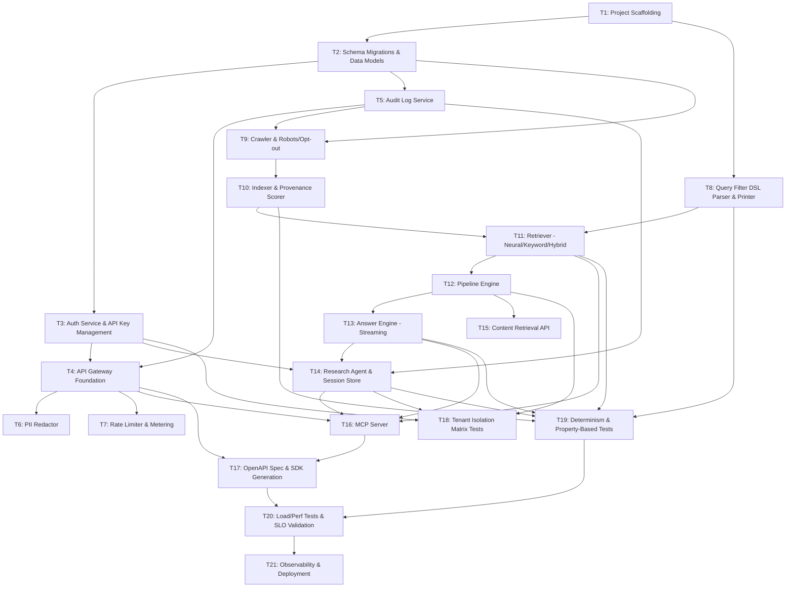

# Implementation Tasks

## Task Dependency Graph

## Tasks

### Task 1: Project Scaffolding
**Requirements:** All | **Design:** Architecture Overview, Deployment Topology

- [x] 1.1: Initialize monorepo structure (Python backend, TypeScript SDK workspace)
- [x] 1.2: Set up dependency management (Poetry/uv for Python, pnpm for TypeScript)
- [x] 1.3: Configure linting, formatting, pre-commit hooks (ruff, black, eslint, prettier)
- [x] 1.4: Set up test frameworks: pytest + Hypothesis (Python), vitest + fast-check (TypeScript)
- [x] 1.5: Configure CI pipeline (lint, type-check, test, build)
- [x] 1.6: Create Docker Compose for local dev (Postgres, OpenSearch, Redis, Kafka)
- [x] 1.7: Create shared config module (env vars, feature flags, tenant defaults)

---

### Task 2: Schema Migrations & Data Models
**Requirements:** R2, R8, R9, R10, R13, R14, R15 | **Design:** Data Models section, ER diagram

- [x] 2.1: Create Postgres migration for `tenants` table with RLS policies
- [x] 2.2: Create migration for `api_keys` table (prefix-indexed, Argon2id hash, rotation fields per R13.5)
- [x] 2.3: Create migration for `documents` and `document_versions` tables (stable document_id, version monotonicity, content_hash, provenance fields)
- [x] 2.4: Create migration for `sessions` table (tenant-scoped, retention_days, memory ring buffers)
- [x] 2.5: Create migration for `pipelines` and `pipeline_steps` tables (1–20 steps, registry_name, timeout_ms)
- [x] 2.6: Create migration for `research_jobs`, `research_plans`, `plan_steps`, `events` tables
- [x] 2.7: Create migration for `citations` table (FK to document_versions, offset ranges)
- [x] 2.8: Create migration for `audit_events` table (append-only, immutable constraint, retention policy)
- [x] 2.9: Create migration for `rate_limit_buckets` and `metering_events` tables
- [x] 2.10: Create S3-compatible object store layout for cleaned text (`tenant_id/doc_id/version`)
- [x] 2.11: Write unit tests validating RLS policies block cross-tenant reads/writes

---

### Task 3: Auth Service & API Key Management
**Requirements:** R13 | **Design:** Auth_Service component, Properties 31–34

- [x] 3.1: Implement `authenticate(headers)` — bearer extraction, Argon2id hash lookup, tenant resolution within 50ms p95 (R13.1)
- [x] 3.2: Implement key revocation propagation within 60s via cache TTL (R13.4)
- [x] 3.3: Implement key rotation grace period logic `[1, 86400]s` default 3600 (R13.5)
- [x] 3.4: Implement `authorize(tenant_id, resource_tenant_id)` — uniform 404 on cross-tenant (R13.3)
- [x] 3.5: Implement `auth_failure` audit emission (no token logged, null tenant for unknown keys) (R13.6)
- [x] 3.6: Property test — revocation propagates within 60s (Property 32, virtual clock)
- [x] 3.7: Property test — rotation grace window accepts both keys during `[T, T+G]`, only new after (Property 33)
- [x] 3.8: Property test — auth failure audit shape (Property 34)

---

### Task 4: API Gateway Foundation
**Requirements:** R3, R4, R5, R6, R7, R13, R14 | **Design:** API_Gateway component

- [x] 4.1: Set up HTTP framework (FastAPI or similar) with middleware chain: auth → rate-limit → PII-redact → route
- [x] 4.2: Implement request validation middleware (bounds checks for all endpoints per R3.5–R3.7, R4.5–R4.6, R5.5–R5.6, R7.8, R10.5)
- [x] 4.3: Implement uniform error response format with stable error codes
- [x] 4.4: Implement SSE endpoint infrastructure (text/event-stream, keepalive comments every 15s)
- [x] 4.5: Implement WebSocket endpoint infrastructure for `/v1/answer` (cancel support)
- [x] 4.6: Implement `X-Request-Id` generation (16–64 code points) and propagation
- [x] 4.7: Property test — bounds-violation requests rejected with correct codes, downstream not invoked (Property 8)

---

### Task 5: Audit Log Service
**Requirements:** R15 | **Design:** Audit_Log component, Properties 39–41

- [x] 5.1: Implement append-only `Audit_Log.append(entry)` with 5s latency target (R15.1)
- [x] 5.2: Implement immutability enforcement — reject any non-append write (R15.4)
- [x] 5.3: Implement privileged-action blocking on append failure with `audit_log_unavailable` error (R15.6)
- [x] 5.4: Implement configurable retention `[365, 2555]` days (R15.4)
- [x] 5.5: Implement tenant data deletion with legal-hold partitioning (R15.3, R15.5)
- [x] 5.6: Implement cross-tenant deletion request → 404 `resource_not_found` (R15.7)
- [x] 5.7: Property test — append-only invariant (Property 40)
- [x] 5.8: Property test — privileged actions block on audit failure (Property 39)
- [x] 5.9: Property test — deletion partitions correctly under legal hold (Property 41)

---

### Task 6: PII Redactor
**Requirements:** R15.2 | **Design:** PII_Redactor component, Property 38

- [x] 6.1: Implement pattern detection: email (RFC 5322), phone (E.164), US SSN, EU national ID, credit card (Luhn)
- [x] 6.2: Implement `redact(text)` → text with placeholders; original never crosses to audit/analytics
- [x] 6.3: Property test — PII patterns are absent from redacted output (Property 38)

---

### Task 7: Rate Limiter & Metering
**Requirements:** R14 | **Design:** Rate Limiter, Properties 35–37

- [ ] 7.1: Implement token-bucket rate limiter per `(tenant_id, endpoint)` in Redis (R14.1)
- [ ] 7.2: Implement `X-RateLimit-Limit`, `X-RateLimit-Remaining`, `X-RateLimit-Reset` headers (R14.4)
- [ ] 7.3: Implement 429 response with `Retry-After` in `[1, 3600]`s (R14.1)
- [ ] 7.4: Implement metering event emission (one per billable 2xx response) with at-least-once delivery (R14.2, R14.3)
- [ ] 7.5: Implement durable local buffer for metering pipeline outage; audit at 80% fill (R14.5)
- [ ] 7.6: Property test — rate-limited responses have valid headers (Property 35)
- [ ] 7.7: Property test — exactly one metering event per billable response after dedup (Property 36)
- [ ] 7.8: Property test — metering outage does not block API responses (Property 37)

---

### Task 8: Query Filter DSL Parser & Printer
**Requirements:** R11 | **Design:** Query_Filter_DSL Grammar, Filter_AST shape, Properties 22–25

- [ ] 8.1: Implement EBNF grammar as a recursive-descent or PEG parser (≤100ms on single core, R11.1)
- [ ] 8.2: Implement Filter_AST data types (And, Or, Not, Eq, Ne, In, Range + literal types)
- [ ] 8.3: Implement structural-equivalence comparison per R11.7 (commutative multiset, non-commutative ordered, normalized literals)
- [ ] 8.4: Implement Query_Filter_Printer with canonical form (sorted commutative children, normalized literals)
- [ ] 8.5: Implement error reporting: 1-indexed line/column, 1–256 char description, no partial AST (R11.3)
- [ ] 8.6: Implement bounds enforcement: empty/whitespace → `empty_input` (R11.2); >16384 code points or >32 nesting or >1024 leaves → `filter_too_large` (R11.4)
- [ ] 8.7: Property test — `parse(print(ast)) ≡ ast` for all well-formed ASTs (Property 22)
- [ ] 8.8: Property test — `parse(print(parse(s))) ≡ parse(s)` for all parseable strings (Property 23)
- [ ] 8.9: Property test — oversized/over-nested/over-leaf inputs rejected with `filter_too_large` (Property 24)
- [ ] 8.10: Property test — invalid input produces structured error, no partial AST (Property 25)

---

### Task 9: Crawler & Robots/Opt-out
**Requirements:** R1 | **Design:** Crawler component, Properties 3–4

- [ ] 9.1: Implement robots.txt fetcher with 10s timeout and ≤24h cache (R1.1)
- [ ] 9.2: Implement robots.txt failure handling (network error/timeout/5xx → skip + audit `robots_unavailable`) (R1.3)
- [ ] 9.3: Implement disallowed-URL detection and audit `disallowed_by_robots` (R1.2)
- [ ] 9.4: Implement per-host concurrency semaphore `[1, 8]` default 2 (R1.4)
- [ ] 9.5: Implement Crawl-Delay enforcement: `max(host_crawl_delay, 1s)` between requests (R1.5)
- [ ] 9.6: Implement opt-out registry with 24h activation window + audit `domain_opted_out` (R1.6)
- [ ] 9.7: Implement fetch metadata recording (UTC timestamp, HTTP status, Content-Type, canonical URL) (R1.7)
- [ ] 9.8: Property test — per-host concurrency and Crawl-Delay (Property 3, simulated)
- [ ] 9.9: Property test — opt-out retroactively excludes domain after 24h (Property 4, virtual clock)

---

### Task 10: Indexer & Provenance Scorer
**Requirements:** R2, R10 | **Design:** Indexer, Provenance_Scorer components, Properties 1–2, 5, 20–21

- [ ] 10.1: Implement content cleaning pipeline (HTML → cleaned text)
- [ ] 10.2: Implement content hashing (SHA-256 over cleaned text) for idempotent re-indexing (R2.4)
- [ ] 10.3: Implement stable `document_id` assignment at first ingest; version increment by exactly 1 on new hash (R2.3)
- [ ] 10.4: Implement `last_seen_at`-only update when hash matches (R2.4)
- [ ] 10.5: Implement DLQ routing after 3 retries spaced ≥60s + `index_failure` audit (R2.5)
- [ ] 10.6: Implement priority-source re-crawl scheduling (at least once per 24h rolling window) (R2.2)
- [ ] 10.7: Implement Provenance_Scorer: credibility_score + ai_generated_likelihood in [0.0, 1.0], scored_at (R10.1)
- [ ] 10.8: Implement scoring gate — document not visible to Retriever until scored (R10.1)
- [ ] 10.9: Implement rescore path preserving document_id/version, mutating only score fields (R10.6)
- [ ] 10.10: Implement vector embedding generation and write to vector index
- [ ] 10.11: Implement lexical index write (BM25 with fixed analyzer)
- [ ] 10.12: Property test — re-index identical content is idempotent (Property 1)
- [ ] 10.13: Property test — re-index changed content increments version by exactly 1 (Property 2)
- [ ] 10.14: Property test — provenance scores in [0.0, 1.0] (Property 20 range)
- [ ] 10.15: Property test — rescore preserves document_id/version, mutates only score fields (Property 20 frame)

---

### Task 11: Retriever — Neural, Keyword, and Hybrid Search
**Requirements:** R3, R4, R10 | **Design:** Retriever component, Properties 5–7, 21

- [ ] 11.1: Implement neural retrieval (vector ANN with seeded HNSW, fixed efSearch)
- [ ] 11.2: Implement keyword retrieval (BM25 with fixed analyzer pipeline)
- [ ] 11.3: Implement hybrid retrieval (Reciprocal-Rank Fusion with fixed k)
- [ ] 11.4: Implement strict total ordering: `score DESC, document_id ASC, version ASC` (deterministic tie-break)
- [ ] 11.5: Implement `X-Index-Version` header on responses (monotonic integer per tenant view)
- [ ] 11.6: Implement warm-cache layer keyed by `(tenant_id, query, mode, filters, pipeline_id, num_results)` with 5-min TTL (R3.2)
- [ ] 11.7: Implement `min_credibility` filtering (strict-less-than excluded, equality included) (R10.3)
- [ ] 11.8: Implement `max_ai_generated_likelihood` filtering (strict-greater-than excluded, equality included) (R10.4)
- [ ] 11.9: Implement `find_similar` — exclude every version of input document_id (R4.2)
- [ ] 11.10: Implement URL canonicalization for find_similar (lowercase scheme/host, strip fragment, normalize trailing slash) (R4.3)
- [ ] 11.11: Property test — response shape and score ordering invariants (Property 5)
- [ ] 11.12: Property test — deterministic ranking against unchanged index version (Property 6)
- [ ] 11.13: Property test — find_similar excludes all versions of input document (Property 7)
- [ ] 11.14: Property test — threshold boundary inclusion/exclusion (Property 21)

---

### Task 12: Pipeline Engine
**Requirements:** R9 | **Design:** Pipeline_Engine component, Properties 26–28

- [ ] 12.1: Implement pipeline registry (built-in filters, rerankers, transforms)
- [ ] 12.2: Implement `POST /v1/pipelines` — validate step names, persist with tenant scope, return 201 + pipeline_id (R9.1)
- [ ] 12.3: Implement unknown-step rejection with HTTP 400 listing all offending names (R9.2)
- [ ] 12.4: Implement pipeline execution: steps in declared order, output→input chaining (R9.3)
- [ ] 12.5: Implement implicit type ordering: filters → rerankers → transforms (R9.4)
- [ ] 12.6: Implement per-step timeout `[100, 30000]ms` default 2000; skip on timeout, pass-through input, append `step_timeout` warning (R9.6)
- [ ] 12.7: Implement `pipeline_not_found` 404 for cross-tenant/missing pipeline_id (R9.7)
- [ ] 12.8: Property test — pipeline composition is order-preserving and respects type precedence (Property 26)
- [ ] 12.9: Property test — step timeout falls back to pass-through with warning (Property 27)
- [ ] 12.10: Property test — unknown step names rejected atomically (Property 28)

---

### Task 13: Answer Engine — Streaming with Citations
**Requirements:** R5, R6 | **Design:** Answer_Engine component, Properties 10–14

- [ ] 13.1: Implement LLM provider abstraction (OpenAI/Anthropic) with streaming token output
- [ ] 13.2: Implement SSE streaming for `/v1/answer` — first token within 3s p95 (R6.1)
- [ ] 13.3: Implement citation emission within 500ms of supported span with offset ranges (R6.2)
- [ ] 13.4: Implement citation referential integrity check — `(document_id, version)` must be in retrieval set (R6.4)
- [ ] 13.5: Implement `done` event with full answer text + complete citation set (R6.3)
- [ ] 13.6: Implement error handling: empty retrieval set → `no_sources_available` (R6.6)
- [ ] 13.7: Implement error handling: model failure or 30s silence → `error` event, close within 2s (R6.5)
- [ ] 13.8: Implement WebSocket framing with client `cancel` support
- [ ] 13.9: Implement `/v1/contents` highlights (≤5 spans, half-open offsets) (R5.2)
- [ ] 13.10: Implement `/v1/contents` summaries (1–512 tokens) (R5.3)
- [ ] 13.11: Property test — highlight spans are valid half-open ranges (Property 10)
- [ ] 13.12: Property test — summaries within token bounds (Property 11)
- [ ] 13.13: Property test — `done` event reflects full stream (Property 12)
- [ ] 13.14: Property test — citations reference retrieval result set (Property 13)
- [ ] 13.15: Property test — failure modes emit exactly one terminal error (Property 14)

---

### Task 14: Research Agent & Session Store
**Requirements:** R7, R8 | **Design:** Research_Agent, Session_Store components, Properties 15–18, 29–30

- [ ] 14.1: Implement `POST /v1/research` — validate goal (1–4096 chars), optional output_schema, return job_id within 1s p95 (R7.1, R7.8)
- [ ] 14.2: Implement Research_Plan generation (1–32 steps with typed labels) as first event (R7.2)
- [ ] 14.3: Implement tool-use loop: Research_Agent calls Retriever, Pipeline_Engine, Answer_Engine iteratively
- [ ] 14.4: Implement SSE event stream with strictly monotonic event_id (R7.3)
- [ ] 14.5: Implement `Last-Event-ID` replay from per-job durable buffer (≥24h retention) (R7.3)
- [ ] 14.6: Implement budget enforcement: max_steps, max_duration_ms, max_tool_calls → `budget_exceeded` + partial report (R7.6)
- [ ] 14.7: Implement `GET /v1/research/{job_id}` — final report with citations; partial on budget_exceeded (R7.4, R7.6)
- [ ] 14.8: Implement output_schema validation on final report (R7.5)
- [ ] 14.9: Implement cross-tenant job access → 404 `job_not_found` (R7.7)
- [ ] 14.10: Implement `POST /v1/sessions` — create with retention_days [1, 90] default 14 (R8.1)
- [ ] 14.11: Implement session memory: ≤50 recent citations + ≤20 recent doc_ids incorporated into research/answer (R8.2)
- [ ] 14.12: Implement session expiry sweep: delete within 24h of expiry, emit `session_expired` audit (R8.4)
- [ ] 14.13: Implement cross-tenant/expired/missing session → uniform 404 `session_not_found` (R8.5)
- [ ] 14.14: Property test — SSE event_id strictly monotonic and replayable (Property 15)
- [ ] 14.15: Property test — research report citations reference indexed documents (Property 16)
- [ ] 14.16: Property test — output_schema validation (Property 17)
- [ ] 14.17: Property test — budget exceedance terminates with partial report (Property 18)
- [ ] 14.18: Property test — session memory bounds and recency (Property 29)
- [ ] 14.19: Property test — session expiry deletes memory and stops incorporation (Property 30)

---

### Task 15: Content Retrieval API
**Requirements:** R5 | **Design:** Answer_Engine (summaries/highlights), Properties 9–11

- [ ] 15.1: Implement `POST /v1/contents` — batch fetch 1–100 document_ids, preserve request order (R5.1)
- [ ] 15.2: Implement per-document error handling: `document_not_found` for missing docs, success for rest (R5.7)
- [ ] 15.3: Implement version field on each returned document matching indexed version (R5.4)
- [ ] 15.4: Implement validation: count bounds (R5.5), highlights without query (R5.6)
- [ ] 15.5: Property test — preserves request order and reports per-id errors locally (Property 9)

---

### Task 16: MCP Server
**Requirements:** R12 | **Design:** MCP_Server component, Property 42

- [ ] 16.1: Implement MCP tool definitions with JSON Schema for input/output (search, find_similar, contents, answer, research) (R12.1)
- [ ] 16.2: Implement tool dispatch to backing subsystems (Retriever, Search_Engine, Answer_Engine, Research_Agent) (R12.2)
- [ ] 16.3: Implement input schema validation → MCP-standard validation error on failure (R12.3)
- [ ] 16.4: Implement shared auth + rate limits with REST gateway (R12.4–R12.6)
- [ ] 16.5: Implement output schema validation → MCP-standard tool-execution error on subsystem failure (R12.7)
- [ ] 16.6: Property test — MCP tool input/output schema validation (Property 42)

---

### Task 17: OpenAPI Spec & SDK Generation
**Requirements:** R16 | **Design:** API Contract, Properties 43–46

- [ ] 17.1: Author OpenAPI 3.1 spec at `/v1/openapi.json` covering all endpoints, event shapes, error codes
- [ ] 17.2: Generate Python SDK from OpenAPI (typed methods for all endpoints, async iterators for streams) (R16.1, R16.2)
- [ ] 17.3: Generate TypeScript SDK from OpenAPI (typed methods, async iterators) (R16.1, R16.2)
- [ ] 17.4: Implement SDK error mapping: non-2xx, timeout, connection failure → typed exception (R16.3)
- [ ] 17.5: Implement SDK bearer header injection from configured key (R16.5)
- [ ] 17.6: Publish Python SDK to PyPI, TypeScript SDK to npm (R16.1)
- [ ] 17.7: Property test — SDK streaming iterators yield documented events and terminate (Property 43)
- [ ] 17.8: Property test — SDK error mapping (Property 44)
- [ ] 17.9: Property test — SDK/OpenAPI surface equivalence (Property 45)
- [ ] 17.10: Property test — SDKs always send bearer header (Property 46)

---

### Task 18: Tenant Isolation Matrix Tests
**Requirements:** R7.7, R8.5, R9.7, R13.3, R15.7 | **Design:** Multi-tenant Isolation Strategy, Property 19

- [ ] 18.1: Implement parameterized test matrix across all resource types (research_job, session, pipeline, audit_entry, deletion_target, metering_record, api_key)
- [ ] 18.2: Property test — cross-tenant access returns uniform 404 indistinguishable from not-found (Property 19)
- [ ] 18.3: Property test — same-tenant access succeeds with standard 2xx (Property 19 converse)
- [ ] 18.4: Verify RLS policies at DB level with direct SQL cross-tenant attempts

---

### Task 19: Determinism & Comprehensive Property-Based Tests
**Requirements:** R3.4, R4.4, R9.5, R6.4, R2.3, R2.4 | **Design:** Determinism Strategy, Properties 1–46

- [ ] 19.1: Implement X-Index-Version pinning infrastructure (monotonic integer per tenant, included in responses)
- [ ] 19.2: Property test — deterministic ranking with pinned index version (Property 6, two consecutive runs byte-identical)
- [ ] 19.3: Property test — third run after synthetic index mutation confirms version pin works
- [ ] 19.4: Integration test — end-to-end ingest → search → verify determinism across service restarts
- [ ] 19.5: Aggregate property test run: ensure all 46 properties pass in CI with ≥100 iterations each

---

### Task 20: Load/Perf Tests & SLO Validation
**Requirements:** R2.1, R3.2, R6.1, R7.1, R11.1, R13.1 | **Design:** Cross-cutting Concerns (Observability)

- [ ] 20.1: Load test — search warm-cache p95 ≤800ms (R3.2)
- [ ] 20.2: Load test — auth resolution p95 ≤50ms (R13.1)
- [ ] 20.3: Load test — first answer token p95 ≤3s (R6.1)
- [ ] 20.4: Load test — research job_id return p95 ≤1s (R7.1)
- [ ] 20.5: Load test — parser p95 ≤100ms on single core (R11.1)
- [ ] 20.6: Integration test — fetch-to-searchable p95 ≤60min, p99 ≤4h (R2.1)
- [ ] 20.7: Set up continuous SLO monitoring dashboards with alerting

---

### Task 21: Observability & Deployment
**Requirements:** All | **Design:** Cross-cutting Concerns, Deployment Topology

- [ ] 21.1: Instrument all subsystems with OpenTelemetry tracing (request_id propagation)
- [ ] 21.2: Set up structured JSON logging with tenant_id, request_id, endpoint (PII-redacted)
- [ ] 21.3: Configure Prometheus metrics for all SLO targets (auth.duration_ms, search.warm_cache.duration_ms, answer.first_token_latency_ms, etc.)
- [ ] 21.4: Create Kubernetes manifests / Helm charts for stateless edge (API_Gateway, MCP_Server)
- [ ] 21.5: Create manifests for query plane services (Retriever, Pipeline_Engine, Answer_Engine, Research_Agent)
- [ ] 21.6: Create manifests for ingest plane (Crawler workers sharded by host, Indexer workers sharded by document_id)
- [ ] 21.7: Configure Kafka topics (crawl.fetched, index.dlq, metering.events, audit.events, research.events)
- [ ] 21.8: Set up secrets management (KMS-backed envelope encryption for API keys, provider keys)
- [ ] 21.9: Create staging environment deployment pipeline
- [ ] 21.10: Create production deployment pipeline with canary rollout
